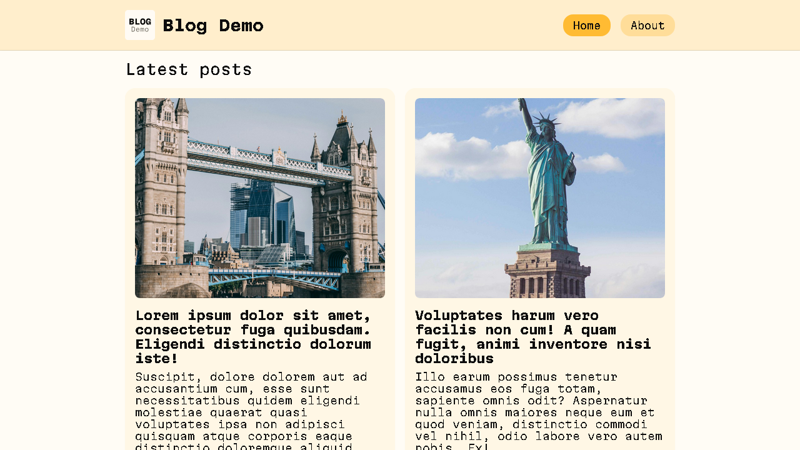
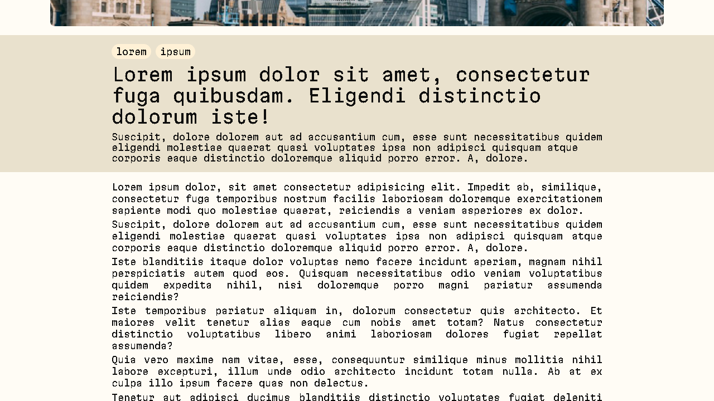
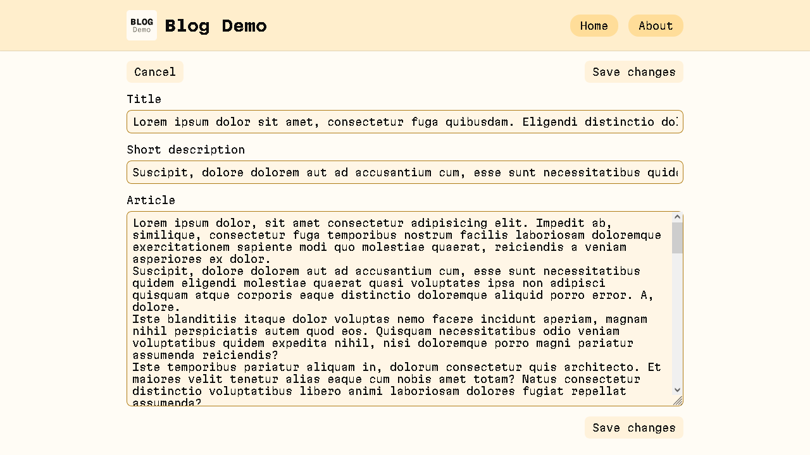
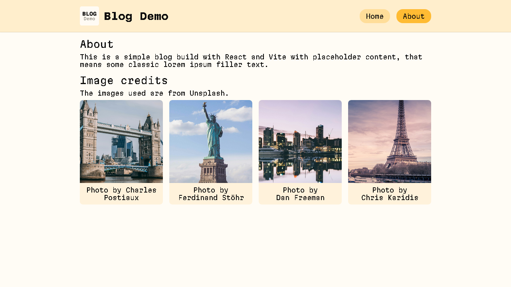

# Blog Demo


A small React + Vite blog demo application that enables view posts and edit them. The default posts contents are filler Lorem text, and this project is minimal and demonstrate routing, components, and styling.

Live demo: [blog-demo](https://giovannieliasdarosa.github.io/blog-demo/)

## Contents

- [Screenshots](#screenshots)
- [Features](#features)
- [How to run locally](#how-to-run-locally)
- [Project layout](#project-layout)
- [Usage notes](#usage-notes)

## Screenshots

<div style="display: flex; flex-wrap: nowrap; overflow: auto; gap: 1em">
  
  
  
  
  
</div>

## Features

- Built with React and Vite
- Client-side routing

## How to run locally

### Prerequisites

- Node.js [Official NodeJS Website](https://nodejs.org/en/download), this will automatically install `npm` which is necessary to run the project

### Clone repository

1. Clone this repository and unzip it
2. Open the folder in a terminal

### Install packages

1. Install dependencies

```bash
npm install
```

2. Run the dev server

```bash
npm run dev
```

## Project layout

- **public/**
  - **assets/**
    - **fonts/**
    - **icons/**
    - **images/**
- **src/**
  - main.jsx - app entry
  - App.jsx - router, layout setup
  - **pages/**
    - **AboutPage/** - about the project and image credits
    - **HomePage/** - post list
    - **NotFoundPage/** - when the route doesn't exist
    - **Post/**
      - **Edit/** - single post view
      - **Show/** - single post edit
  - **components/**
    - **BetterImage/** - Enable better image loading by using a thumbnail while the real image loads
    - **Header/**
  - **contexts/**
    - PostsContext.jsx - enable project wide access to posts data
  - **data/**
    - posts.js - example filler posts
  - **styles/**
    - index.css
    - variables.css
    - fonts.css
    - base.css
    - layout.css
    - inputs.css

## Usage notes

- Routes are defined in `App.jsx`
- The file `src/data/posts.json` contains all the posts data, you can replace it with your own data source

### Example post item (src/data/posts.js)

```json
[
  {
    "id": 1,
    "title": "Super cool blog title",
    "shortDescription": "Eye catching text to interest users here",
    "article": [
      "Post line 1",
      "Post line 2",
      // More post lines...
    ],
    "image": {
      "src": "image url here, prefixed path as 'public/assets/images'",
      "alt": "Alternative text for accessibility",
      "author": "Who's image is this",
      "href": "Link for where the image is from"
    },
    "tags": ["tag1", "tag2"]
  },
  // More posts...
];
```
